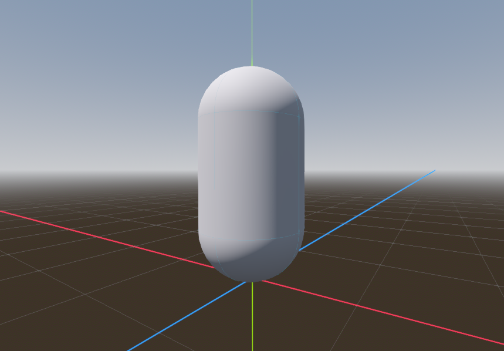
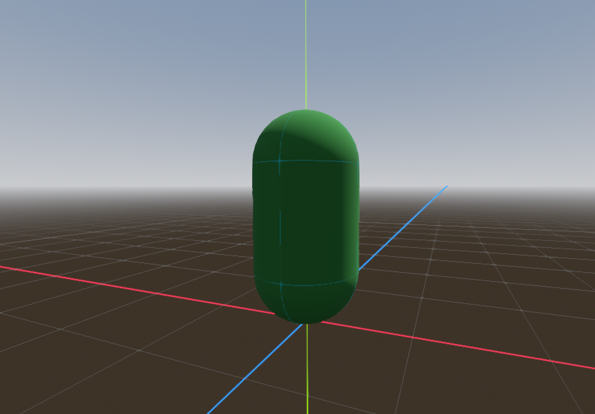
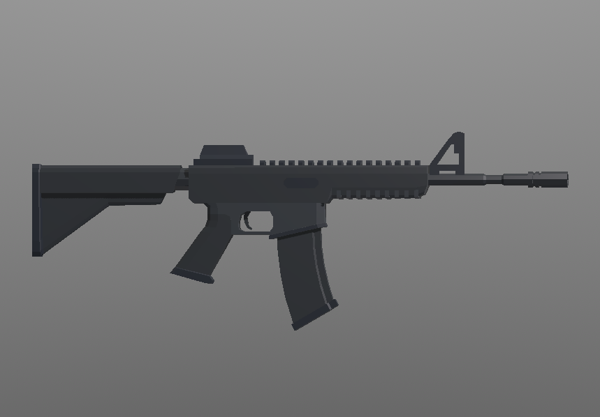
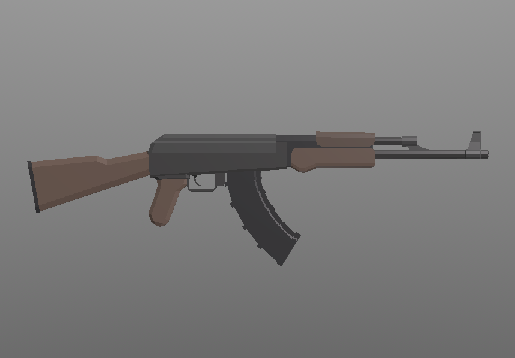
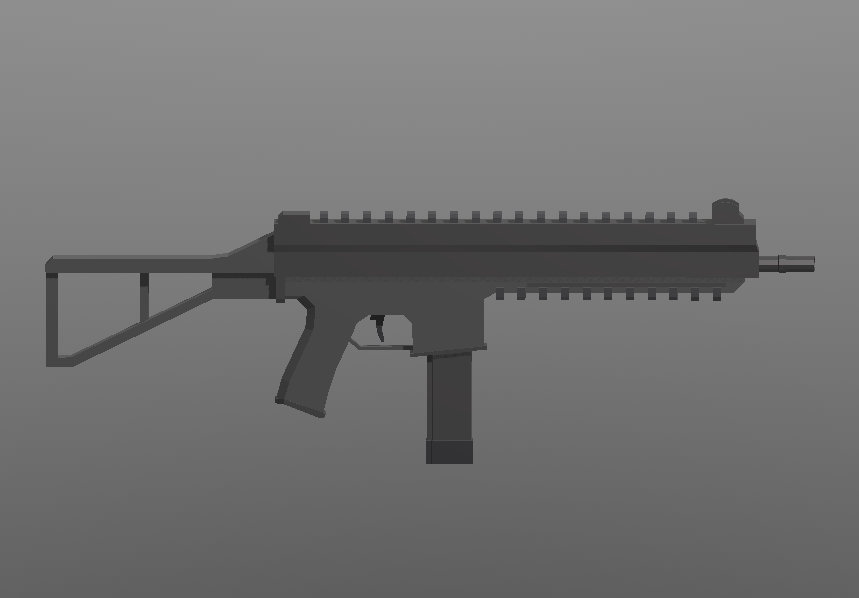
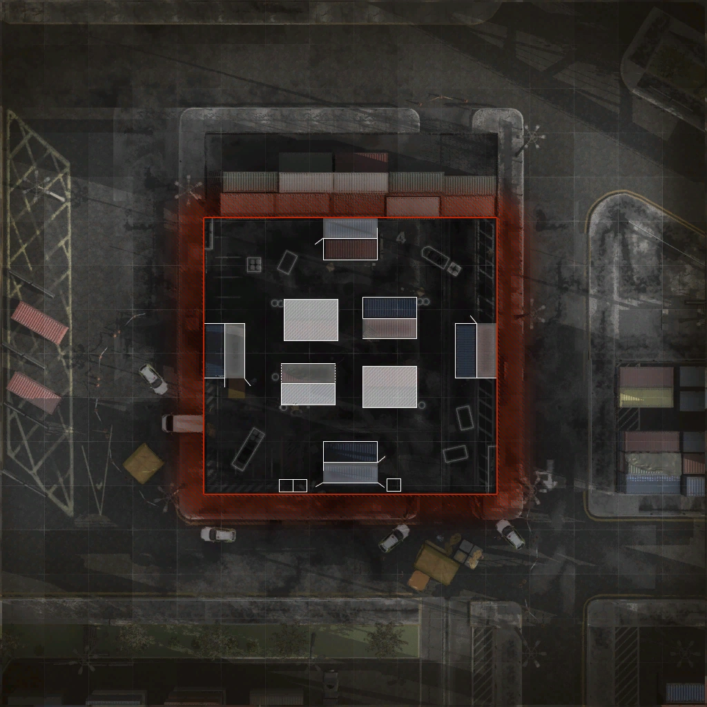
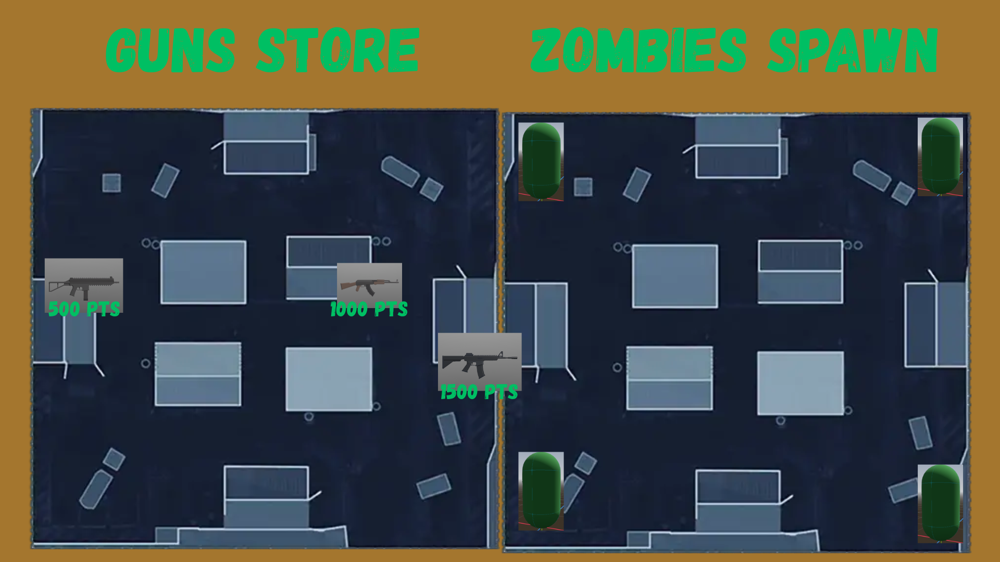
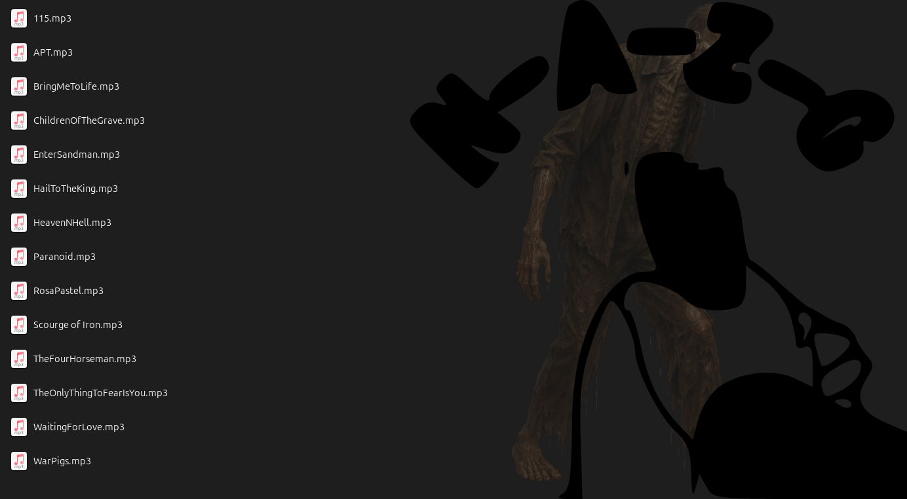

# 🧟 Not a Zombies Game (NZG)


> "Sí, como CoD Zombies pero humilde."

**NZG** es un shooter de supervivencia en primera persona desarrollado en **Godot Engine**. El núcleo del juego se centra en la resistencia por oleadas, donde la gestión de recursos y el movimiento estratégico son la única diferencia entre sobrevivir o ser rodeado por la horda.

---

## 📸 Galería del Proyecto

### Protagonista y Amenazas
| Jugador (POV/Modelo) | Enemigo (Zombie) |
| :---: | :---: |
|  |  |

### Arsenal de Supervivencia
 |  | 
*Visualización del sistema de armas actual (Pistola, Rifle y Escopeta).*

### Entorno y Navegación
| Mapa del Nivel | Mapa de Pistas / Ayuda |
| :---: | :---: |
|  |  |

### Atmósfera Sonora

*Curaduría musical diseñada para aumentar la tensión conforme avanzan las rondas.*

---

## 🚀 Características Principales

* **Combate Dinámico:** Sistema de disparo funcional con retroalimentación básica.
* **Hordas Progresivas:** Incremento gradual de la dificultad por oleada.
* **Economía de Puntos:** Sistema de puntuación basado en bajas confirmadas.
* **Diseño Minimalista:** Interfaz de usuario (UI) limpia para maximizar la inmersión.

---

## 🛠️ Stack Tecnológico

* **Motor:** [Godot Engine 4.x](https://godotengine.org/)
* **Lenguaje:** GDScript
* **Control de Versiones:** Git
* **Plataforma Objetivo:** PC (Windows/Linux)

---

## 📊 Estado del Proyecto

### ✅ Finalizado e Implementado
- [x] Controlador de movimiento avanzado (Caminar, Correr).
- [x] Sistema de disparo base.
- [x] Layout del mapa inicial.
- [x] HUD de puntuación y estado.

### 🚧 En Desarrollo
- [ ] Refactorización del disparo automático.
- [ ] IA de persecución (NavigationMesh).
- [ ] Sistema de spawn aleatorio de enemigos.
- [ ] Corrección de carga de música ambiental.

---

## 🕹️ Controles de Juego

| Acción | Tecla |
| :--- | :--- |
| **Movimiento** | `W` `A` `S` `D` |
| **Disparar** | `Click Izquierdo` |
| **Sprint (Correr)** | `Shift Izquierdo` |
| **Menú de Pausa** | `ESC` |

---

## 🔧 Instalación y Ejecución

1. **Clonar este repositorio:**
   ```bash
   git clone [https://github.com/Rzztr/ZombiesGamev1.git](https://github.com/Rzztr/ZombiesGamev1.git)